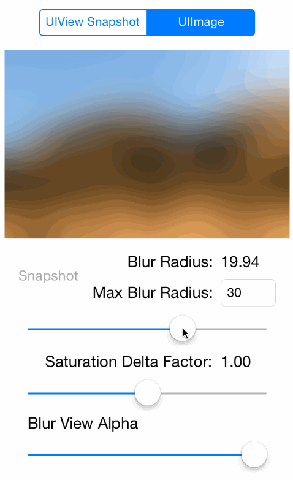

GRKBlurView
===========
A UIView subclass which applies image effects to a given image.

Image affects (blur, saturation) are applied to a base image asynchronously and is
intended to be used for near real time application.

  
(please note the image quality is much better than the above gif, as can be seen below)

#### Future Ideas

* Make changes to properties animatable (using Core Animation).

### Installing

If you're using [CocoPods](http://cocopods.org) it's as simple as adding this to your `Podfile`:

	pod 'GRKBlurView'

### Documentation

Use as you would any other UIView, and simply configure appropriate to your needs.
In the simplest case, all you need supply is the base `targetImage` and a `blurRadius` as
seen below, however, because of asynchronous updates interaction with the effects is
possible and performant.

	@property (nonatomic,weak) IBOutlet GRKBlurView *blurView;

	- (void)viewDidLoad
	{
		[super viewDidLoad];
	
		self.blurView.targetImage = [UIImage imageNamed:@"test"];
		self.blurView.blurRadius = 30.0f;
	}

There is a convenience method to capture a view hierarchy as an image and use that as the
target image:

	- (void)setTargetImageFromView:(UIView *)targetView;

Also please refer to the included GRKBlurViewTestApp for more robust examples.

Additional documentation is available in `GRKBlurView.h`.

#### Disclaimer and Licence

* This work makes use of WWDC 2013 UIImageEffects sample code provided by [Apple](https://developer.apple.com/wwdc/resources/)
* This work makes use of snapshot sample code provided by [Apple](https://developer.apple.com/library/ios/qa/qa1817)
* This work is licensed under the [Creative Commons Attribution 3.0 Unported License](http://creativecommons.org/licenses/by/3.0/).
  Please see the included LICENSE.txt for complete details.

#### About
A professional iOS engineer by day, my name is Levi Brown. Authoring a technical blog
[grokin.gs](http://grokin.gs), I am reachable via:

Twitter [@levigroker](https://twitter.com/levigroker)  
App.net [@levigroker](https://alpha.app.net/levigroker)  
Email [levigroker@gmail.com](mailto:levigroker@gmail.com)  

Your constructive comments and feedback are always welcome.
